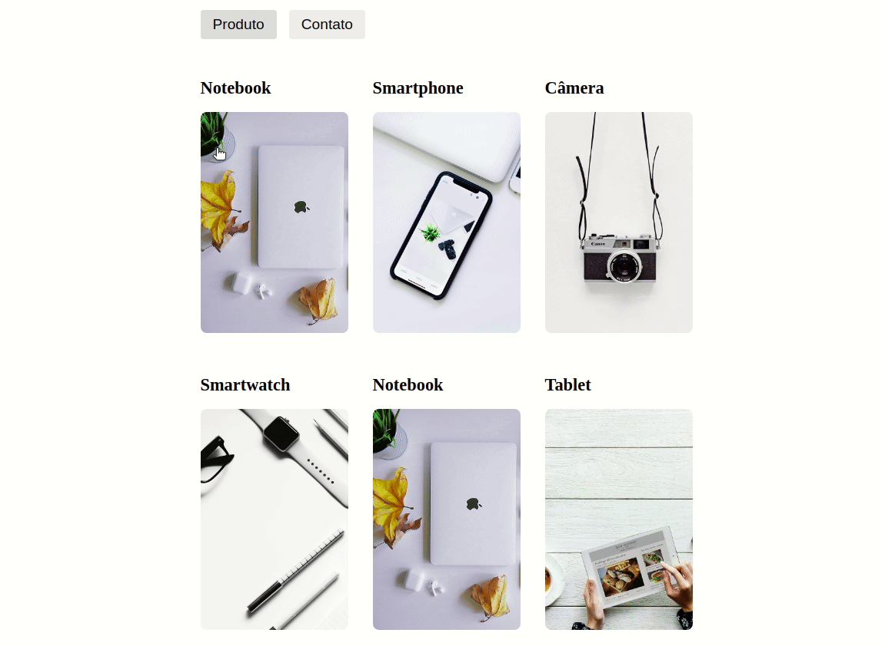

<div>
  <h1 align="center">Vitrine Shop</h1>
  <ul align="center>
    
  <a href="#sobre">Sobre</a>
    |
  <a href="#Tecnologias">Tecnólogias</a>
    |
  <a href="#Dependencias">Dependências</a>
  </ul>
</div>

<div >
<ul>
  
  
  
  
  
  
</ul>

</div>


<div align="center">
  <h3>Sobre.</h3>
  <h4 class="Sobre" > Projeto com referenciando um Ecommerce, que oferece produtos eletrônicos, com finalidade de proporcionar uma experiência agradável para o usuário final. </h4>

  
</div>


<div class="Tecnologias">
  <h3>Tecnológias</h3>
  <ul>
    <li>
      <a href="https://developer.mozilla.org/pt-BR/docs/Web/JavaScript">JavaScript.
      </a>
    </li>
    <li>
      <a href="https://developer.mozilla.org/pt-BR/docs/Web/CSS">CSS3.
      </a>
    </li>
    <li>
      <a href="https://developer.mozilla.org/pt-BR/docs/Web/HTML/HTML5">HTML5.
      </a>
    </li>
    <li>
      <a href="https://pt-br.reactjs.org/docs/getting-started.html">REACT.
      </a>
    </li>
    <li>
      <a href="https://nodejs.org/pt-br/docs/">
        NODE.JS.
      </a>
    </li>
  </ul>
  
</div>

<div class="Dependencias">
  <h3>Dependêcias</h3>
    <p align="center">
      para utilizar da aplicação, será necessario fazer alguns procedimentos de instalção de pacotes
    </p>

```bash
# Clone this repository
$ git clone https://github.com/FullBarbosa/VitrineSHop.git VitrineSHop

# Install dependencies Yarn
$ yarn install

# Install dependencies NPM
$ npm install 

# Install React-Router-Dom 
$ yarn add react-router-dom
```
 </div>


